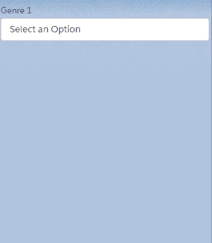

# lightning-multiselect
A screen reader compliant, field level Multiselect picklist component for Lightning with keyboard controls.

Requires [`LightningKit/js/promisify.js` Static Resource](https://github.com/jlyon87/lightning-kit)

## Demo

> Mouse and Keyboard controls



## Usage

```html
<!-- MyComponent.cmp -->
<aura:component>
  <aura:attribute name="myMultipicklistValue" type="String" default="" />
  <c:Multiselect
    label="FieldLabel"
    value="{!v.myMultipicklistValue}"
    sObjectApiName="QuickText"
    fieldApiName="Channel" />
</aura:component>
```

## Deploy to Salesforce

Using the [githubsfdeploy app](https://github.com/afawcett/githubsfdeploy), add this code to your Salesfore Org.

<a target="_blank" rel="noopener noreferrer" href="https://githubsfdeploy.herokuapp.com/app/githubdeploy/jlyon87/lightning-multiselect"></a>
